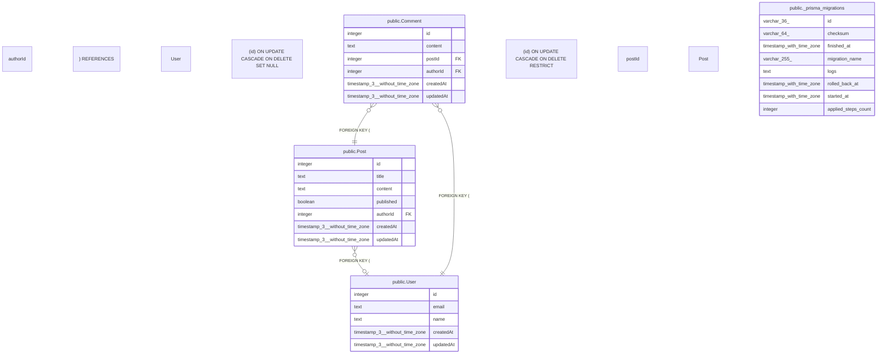

# database

## Tables

| Name | Columns | Comment | Type |
| ---- | ------- | ------- | ---- |
| [public._prisma_migrations](public._prisma_migrations.md) | 8 |  | BASE TABLE |
| [public.User](public.User.md) | 5 |  | BASE TABLE |
| [public.Post](public.Post.md) | 7 |  | BASE TABLE |
| [public.Comment](public.Comment.md) | 6 |  | BASE TABLE |

## Relations

---

> Generated by [tbls](https://github.com/k1LoW/tbls)
