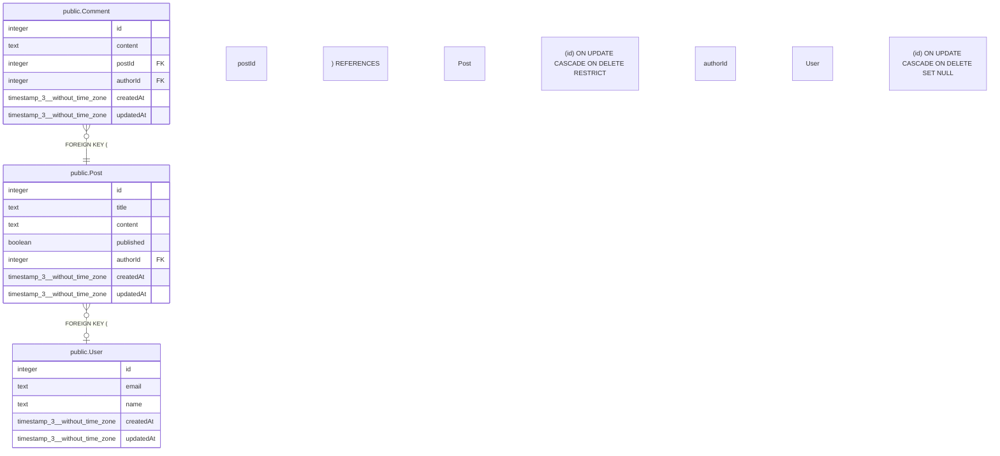

# public.Post

## Description

## Columns

| Name | Type | Default | Nullable | Children | Parents | Comment |
| ---- | ---- | ------- | -------- | -------- | ------- | ------- |
| id | integer | nextval('"Post_id_seq"'::regclass) | false | [public.Comment](public.Comment.md) |  |  |
| title | text |  | false |  |  |  |
| content | text |  | true |  |  |  |
| published | boolean | false | false |  |  |  |
| authorId | integer |  | true |  | [public.User](public.User.md) |  |
| createdAt | timestamp(3) without time zone | CURRENT_TIMESTAMP | false |  |  |  |
| updatedAt | timestamp(3) without time zone |  | false |  |  |  |

## Constraints

| Name | Type | Definition |
| ---- | ---- | ---------- |
| Post_authorId_fkey | FOREIGN KEY | FOREIGN KEY ("authorId") REFERENCES "User"(id) ON UPDATE CASCADE ON DELETE SET NULL |
| Post_pkey | PRIMARY KEY | PRIMARY KEY (id) |

## Indexes

| Name | Definition |
| ---- | ---------- |
| Post_pkey | CREATE UNIQUE INDEX "Post_pkey" ON public."Post" USING btree (id) |

## Relations

---

> Generated by [tbls](https://github.com/k1LoW/tbls)
