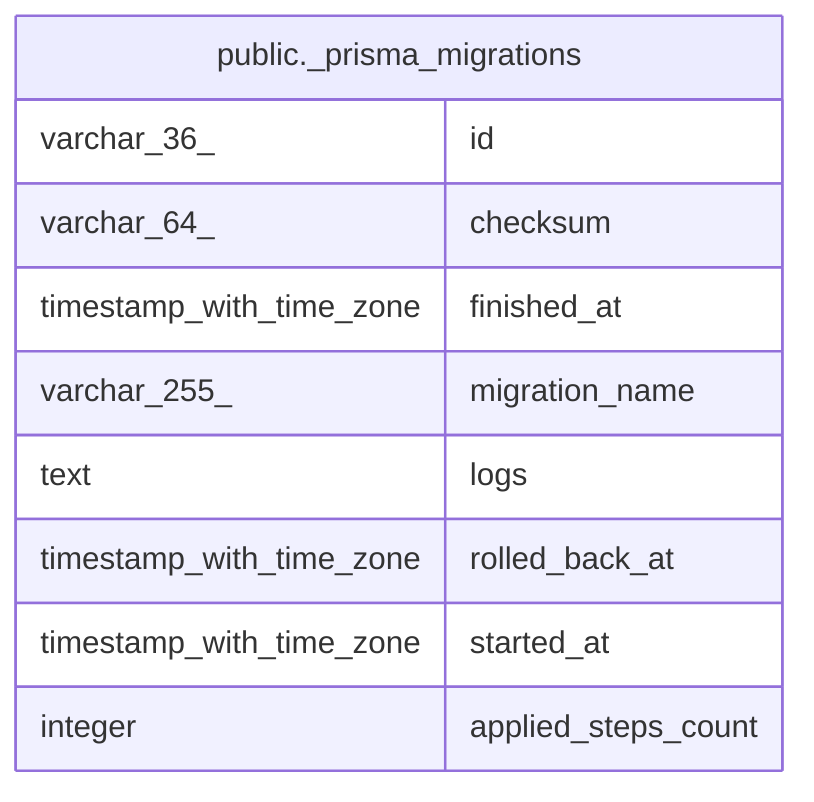

# public._prisma_migrations

## Description

## Columns

| Name | Type | Default | Nullable | Children | Parents | Comment |
| ---- | ---- | ------- | -------- | -------- | ------- | ------- |
| id | varchar(36) |  | false |  |  |  |
| checksum | varchar(64) |  | false |  |  |  |
| finished_at | timestamp with time zone |  | true |  |  |  |
| migration_name | varchar(255) |  | false |  |  |  |
| logs | text |  | true |  |  |  |
| rolled_back_at | timestamp with time zone |  | true |  |  |  |
| started_at | timestamp with time zone | now() | false |  |  |  |
| applied_steps_count | integer | 0 | false |  |  |  |

## Constraints

| Name | Type | Definition |
| ---- | ---- | ---------- |
| _prisma_migrations_pkey | PRIMARY KEY | PRIMARY KEY (id) |

## Indexes

| Name | Definition |
| ---- | ---------- |
| _prisma_migrations_pkey | CREATE UNIQUE INDEX _prisma_migrations_pkey ON public._prisma_migrations USING btree (id) |

## Relations

---

> Generated by [tbls](https://github.com/k1LoW/tbls)
